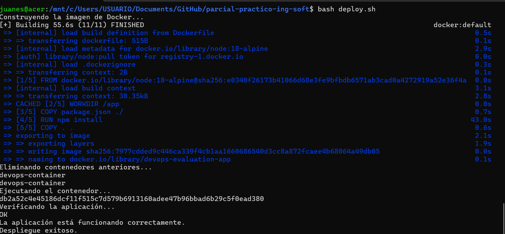

# ArquitecturaSFV-P1

# Evaluación Práctica - Ingeniería de Software V

## Información del Estudiante
- **Nombre:** Juan Esteban Brawn Lozada  
- **Código:** A00381715  
- **Fecha:** 7/03/25

## Resumen de la Solución
Esta solución implementa una aplicación Node.js contenerizada con Docker y automatizada mediante un script de Bash. Se busca facilitar el despliegue y garantizar su correcto funcionamiento en cualquier entorno.  

## Dockerfile
Se creó un Dockerfile para contenerizar la aplicación, asegurando su portabilidad y facilidad de despliegue. Se utilizó una imagen base de Node.js, se instalaron dependencias y se configuró la ejecución del servicio dentro del contenedor.  

## Script de Automatización
El script `deploy.sh` automatiza el proceso de construcción y despliegue de la aplicación. Realiza las siguientes acciones:  
1. **Verifica si Docker está instalado.**  
2. **Construye la imagen de Docker.**  
3. **Elimina contenedores previos si existen.**  
4. **Ejecuta un nuevo contenedor con la configuración adecuada.**  
5. **Prueba la aplicación para verificar que responde correctamente.**  

## Principios DevOps Aplicados
1. **Contenerización:** Permite que la aplicación sea portable y funcione en cualquier entorno sin conflictos.  
2. **Automatización:** Reduce la intervención manual mediante el uso de scripts para el despliegue.  
3. **Integración Continua:** Garantiza que los cambios en el código puedan ser probados y desplegados rápidamente.  

## Captura de Pantalla
 

## Mejoras Futuras
1. **Agregar un pipeline de CI/CD** para automatizar aún más el proceso de despliegue.  
2. **Implementar monitoreo avanzado** con herramientas como Prometheus y Grafana.  
3. **Incluir pruebas automatizadas** para validar el código antes de cada despliegue.  

## Instrucciones para Ejecutar

1. Construir la imagen:
   
   docker build -t devops-parcial .

2. ejecutar el contenedor 
docker run -d -p 8080:8080 --name devops-container -e PORT=8080 -e NODE_ENV=production devops-parcial

3. ejecutar el script

./deploy.sh

